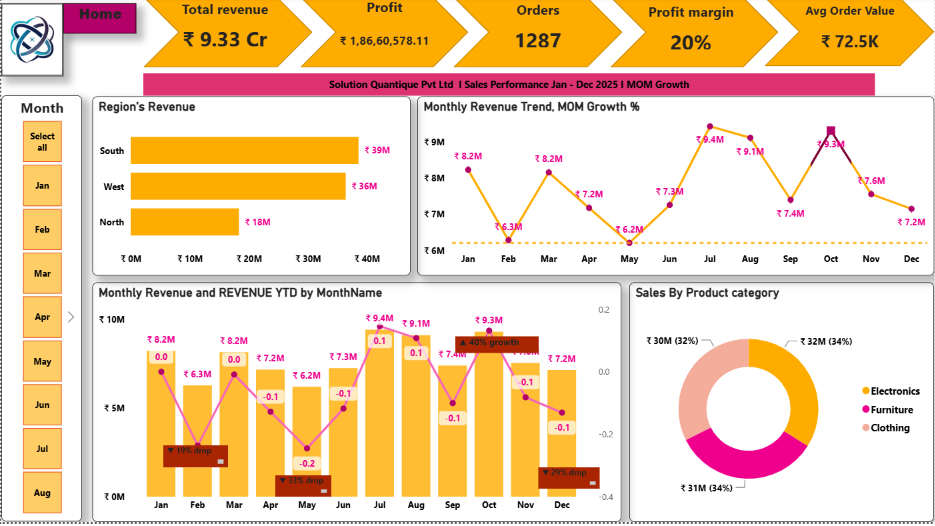

🛒 SuperStore Sales Dashboard 2025 | Power BI

End-to-end Sales Performance Analysis for Solution Quantique Pvt Ltd | Jan-Dec 2025

📸 Dashboard Preview

1. Home - Executive Summary

2. Product Performance

### 3. Customer Insights

### 4. Sales Rep Performance

## 📊 Verified KPIs

| KPI | Value |
| :--- | :--- |
| **Total Revenue** | ₹9.33 Cr |
| **Total Profit** | ₹1,86,60,578 (20% Margin) |
| **Total Orders** | 1,287 |
| **Avg Order Value** | ₹72.5K |
| **Total Customers** | 11 (5 Repeat - 45.5%) |
| **Loss Orders** | 0 |

## 🔍 Key Insights

**1. Regional Performance:** South leads with ₹39M revenue, North lowest at ₹18M. West drives 42% revenue but has lowest profit margin - discount strategy needs review.

**2. Product Mix:** Balanced portfolio - Electronics ₹32M (34%), Furniture ₹31M (34%), Clothing ₹30M (32%). All categories >10% margin.

**3. Bundling Opportunity:** Top Combo = Sofa + Table (4 times). Chair + Sofa also high revenue driver. Cross-sell potential identified.

**4. Customer Dependency:** Top customer Karan Verma ₹2.09 Cr (278 orders) - 22% of total revenue. Top city Bangalore ₹21M. Risk of customer concentration.

**5. Sales Rep:** Ajay - Highest Revenue ₹2.57 Cr (339 orders), Rahul - Best Margin 20.27%. All reps consistent.

**6. Inventory Alert:** Sofa (6.17 days) & Chair (4.29 days) - High Stock-Out Risk at current 1.3 units/day sales.

## 🛠️ Tools & DAX Used

*   **Power BI Desktop, Power Query, DAX Studio, SSMS**
*   **Key DAX:** YTD Revenue, MoM Growth %, Profit Margin %, Top Pair (TOPN + MAXX + ALLSELECTED), AOV, Stock Remaining Days = Current Stock / Daily Units Sold
*   Fixed Top Pair Context Issue: Ensured same table + ALL() for card vs bar chart consistency

## 📁 Files

*   `SuperStore_Sales.pbix` - Power BI File
*   `Dataset.xlsx` - Raw Data
*   `Dashboard_Screenshots/` - 4 Pages

## 🚀 How to Use
Open .pbix > Refresh if needed > Interact with Month slicer (scrollable Jan-Dec) and Region filters.

---
⭐ Star
